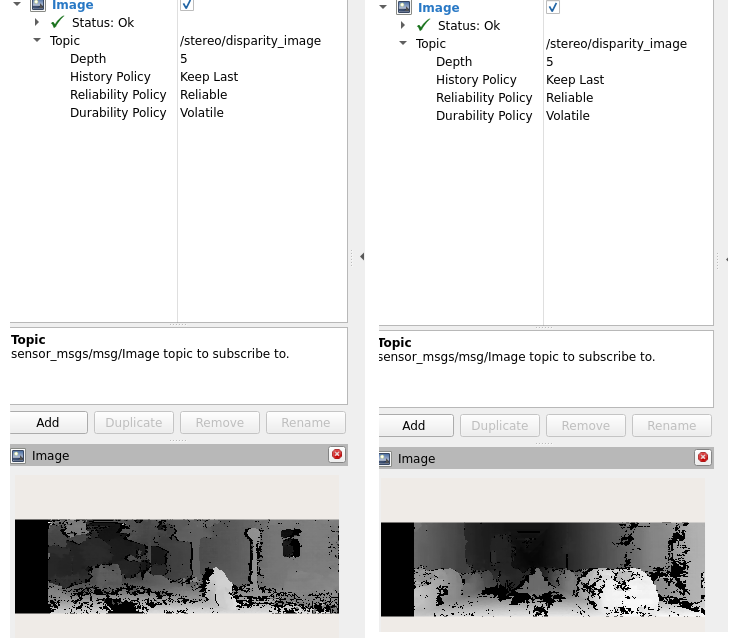

# Real-Time 3D-Aware Object Perception and Proximity Warning using Stereo Vision

This project demonstrates a real-time pipeline for 3D-aware object detection by fusing stereo vision depth estimation with YOLOv8 2D detections. It estimates object 3D positions in the left camera’s 3D coordinate frame, enabling accurate distance-based alerts for dynamic objects like cars and cyclists.

The pipeline runs on KITTI stereo image pairs using ROS 2, and leverages camera calibration parameters (intrinsics and baseline) to convert disparity into metric-scaled 3D coordinates. This forms a key perception module applicable to autonomous driving, robot navigation, and intelligent safety systems.

---
## Learn the Theory (Optional)

To deeply understand how camera geometry and 3D localization work, check out my Medium series:

[CV-8 (Camera Calibration, Extracting Intrinsic, Extrinsic, & Distortion Coefficients)](https://medium.com/@monishatemp20/cv-8-camera-calibration-extracting-intrinsic-extrinsic-distortion-coefficients-64c0bd756c7c)

[CV-10 (3D World Coordinate System to 2D Image Coordinate System)](https://medium.com/@monishatemp20/cv-10-3d-world-coordinate-system-to-2d-image-coordinate-system-d6c6faec353d)

[CV-14 (Visual Odometry: Epipolar Geometry — Part 1)](https://medium.com/@monishatemp20/cv-14-visual-odometry-epipolar-geometry-part-1-ffe06a35fa81)

> Note: For simplicity, COCO class `person` is mapped to KITTI `Cyclist` in this project. This is fine for now because this project does not consider evaluation with MOT/IoU.
>
For advanced class mapping, refer to my earlier project: [Real-Time Multi-Object Tracking on KITTI with ROS 2, YOLOv8 & BYTETrack](https://github.com/Monisha-RK10/Real-Time-Multi-Object-Tracking-on-KITTI-with-ROS-2-YOLOv8-BYTETrack), where I implemented cyclist filter.

---

## Dataset
- **[KITTI Tracking Dataset](http://www.cvlibs.net/datasets/kitti/eval_tracking.php)**
- Real-world driving scenes captured from a moving vehicle with annotations for:
  - `Car`, `Pedestrian`, `Cyclist`
- For this project, only sequence 0000 is used.
  
----
## Pipeline Overview

- **`stereo_image_publisher.py`**
  - Publishes KITTI stereo images as ROS 2 topics.
    - `/camera/left/image_raw`
    - `/camera/right/image_raw`

- **`stereo_depth_node.py`**
  - Subscribes to:
     - `/camera/left/image_raw`
     - `/camera/right/image_raw`

  - Computes:
    - Disparity map using OpenCV's StereoSGBM
    - Depth using known fx, baseline, cx, cy

  - Reprojects:
    - To 3D point cloud using Q matrix

  - Publishes:
    - `/stereo/disparity_image`
    - `/stereo/points_3d`
    - `/stereo/points_3d_dense`

- **`object_fusion_warning_node.py`**
  - Subscribes to:
   - `/camera/left/image_raw` – for YOLOv8 detections
   - `/stereo/points_3d_dense` – for (X, Y, Z) lookup

  - Processes:
    - YOLOv8 detection (`car`, `person` mapped to `Car`, `Cyclist`)
    - 3D coordinate extraction via center pixel or 3×3 patch median
    - Filters out invalid or far objects (Z ≤ 0 or Z > 80 m)
    - Triggers a proximity warning (**⚠️ACHTUNG!!!**) if Z < 8 m
    - Displays color-coded boxes:
      - 🔴 Red: Near (<8 m)
      - 🟡 Yellow: Medium (8–30 m)
      - 🟢 Green: Far (>30 m)

> Note: For simplicity, left and right images are published from the same node with minimal delay. In real-world setups with multiple camera nodes, time synchronization (e.g., ApproximateTimeSynchronizer) and proper header stamping would be essential.
---

## Launch the 3D Perception Pipeline

```bash
ros2 launch perception_pipeline full_pipeline.launch.py
```
> This single line will run subscriber nodes (`stereo_depth_node` + `object_fusion_warning_node`) first, then waits for 5 seconds to run the publisher node (`stereo_image_publisher`) via ROS 2 launch.

---

## Sample Output 

### Intermediate Output (Rviz Disparity Image)



### Demo Warning Output

<p align="center">
  
</p>

[Download full MP4 video](output/output_video.mp4)


## Author

**Monisha**  
Connect via [Medium](https://medium.com/@monishatemp20)  [Linkedin](https://www.linkedin.com/in/monisha-rao-28129676/)

---
